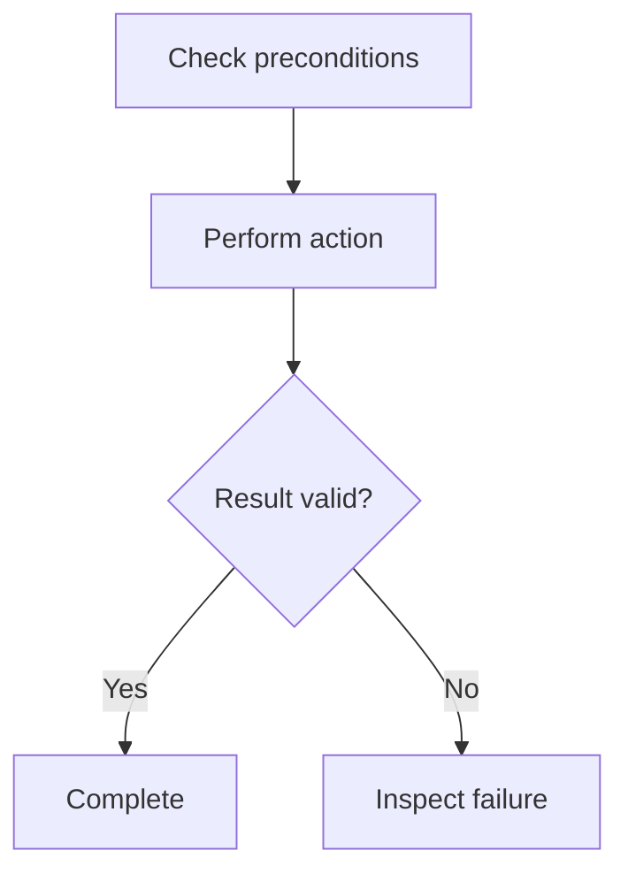

# Entry templates

* Concise instructions instead of prose.
* Replace placeholders with supported project knowledge; remove unused sections.
* Keep `description` within three short sentences and each bullet to one sentence.
* Use `active`, `superseded`, or `deprecated`; include `superseded_by` only for `superseded`.

## Sample 1

````markdown
---
description: <What this procedure does and when to use it.>
status: active
---

## Steps

* <Required precondition.>

1. <First action.>
2. <Next action.>
3. <Check the result.>

> <Important reminder or exception to keep in mind.>

## Flow (Mermaid)



## Snippet or reusable template

```text
<Reusable command, code, or document fragment.>
```

## Source

* <Link to the canonical procedure or verified result.>
````

## Sample 2

````markdown
---
description: <What was observed and when it matters.>
status: active
---

## Findings

* <Observed behavior and relevant conditions.>
* <Uncertainty or limit of the evidence.>
* <What to check before acting on this observation.>

| Condition | Observed result |
| --- | --- |
| <Input or environment> | <Measured or observed outcome> |

## Flow (ASCII art)

```text
+-------+     +-----------+     +-----------------+
| Input | --> | Operation | --> | Observed result |
+-------+     +-----------+     +-----------------+
```

## Source

* <Link to the experiment, incident, or other evidence.>
````

## Sample 3

````markdown
---
description: <Which decision was replaced and when its history is useful.>
status: superseded
superseded_by: <relative-path-to-replacement.md>
---

## Previous decision

* <Previously accepted rule.>
* <Reason for the original choice.>

## Replacement

* <Evidence or accepted decision that replaced the old rule.>
* <Relevant difference in the replacement.>

## Source

* <Link to the adopted replacement and its rationale.>
````

> For a withdrawn entry with no successor, use `status: deprecated`, omit `superseded_by`, and state the reason in a short bullet.
