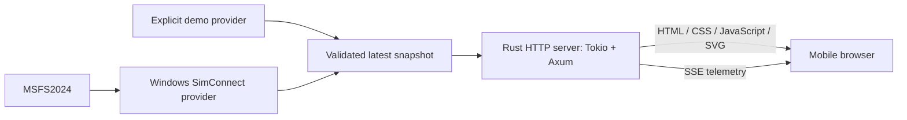

# Architecture

Target design, component responsibilities, and runtime boundaries.

> This document defines architecture. [GitHub Issues](roadmap.md) track implementation and acceptance.

## System



* Select exactly one provider at startup.
* Keep acquisition, normalization, current state, and HTTP in one Rust process.
* Put reusable logic in one library package and thin executables in `src/bin/`.
* Add packages or services only for a concrete need.

> A provider failure must never select demo automatically.

## Boundaries

| Component | Owns |
| --- | --- |
| CLI | clap parsing, help/version, conversion to typed configuration, process signals |
| Configuration | Source selection, listen address/port validation, sampling settings |
| Telemetry | Normalized attitude, validity, sequence, freshness |
| Demo provider | Repeatable scenarios and explicitly marked synthetic data |
| SimConnect provider | SDK types, callbacks, units/signs, simulator lifecycle |
| State distribution | One latest snapshot, bounded memory, shared clients |
| HTTP | Static assets, health, SSE framing, subscriptions, graceful shutdown |
| Browser | Message validation, instrument/status display, receive timeout |

* Keep SDK types outside telemetry and HTTP.
* Give a dedicated worker ownership of blocking SimConnect callbacks.
* Send normalized state from that worker to the async runtime.
* Support Rust builds, runtime, and CI on Windows x64 MSVC only.
* Gate SDK dependencies behind the opt-in `simconnect` feature.
* Keep default Windows tests and demo builds independent of the SDK.

### State distribution

| Rule | Mechanism |
| --- | --- |
| Retain current state only | Tokio latest-value watch channel, no history queue |
| Isolate slow consumers | Skip intermediate samples and bound per-client buffering |
| Keep age current | Recompute age before serialization |
| Detect silent sources | Expire samples server-side even without publications |
| Release stalled clients | Close writers that exceed the socket deadline |

## Intended source layout

Initialize the library package with:

```powershell
cargo init --lib
```

```text
Cargo.toml                  # library and binary targets, edition 2024
Cargo.lock                  # committed dependency lock
src/
  lib.rs                    # reusable API and application assembly
  bin/
    main.rs                 # clap CLI, startup, shutdown wiring
  config.rs
  telemetry.rs              # validated attitude and optional coordinated-turn values
  providers/
    mod.rs                  # source boundary
    demo.rs
    simconnect.rs           # Windows SDK integration
  http/
    mod.rs                  # routes and application state
    sse.rs
web/
  index.html
  styles.css
  app.js                    # EventSource, DOM, page lifecycle
  frame-scheduler.js        # latest-frame scheduling and expiry checks
  panel.js                  # instrument composition and delegation
  horizon.js                # local attitude geometry and transforms
  fixed-symbols.js          # fixed bank scale and aircraft references
  slip-skid.js               # local slip/skid presentation
  turn-rate.js               # local turn-rate presentation
  status.js                  # source/transport labels and unavailability
  svg.js                     # shared SVG helpers
  layout.js                  # responsive instrument regions in CSS pixels
tests/
  http_sse.rs
  fixtures/                 # known attitudes and lifecycle states
.github/workflows/ci.yml
```

### Application API

The `msfs2024_artificial_horizon` library exposes `Config`, `Source`, and `Server`.

| Interface | Contract |
| --- | --- |
| CLI | Use clap derive for source, address/port, help, and version |
| Library configuration | Accept typed `Config`/`Source`. Never read process arguments |
| `Server::bind` | Validate configuration before acquiring the listener |
| `Server::local_address` | Return the bound address |
| `Server::run(shutdown)` | Accept caller-owned shutdown. Only the CLI handles process signals |
| `http::router()` | Build static routes only |
| `http::router_with_telemetry(subscription)` | Add SSE with a caller-supplied channel, without starting acquisition |
| Provider types | Providers own `Source` and `SourceError` |
| Configuration errors | Wrap source availability errors in `ConfigError::Source` |
| Public types | Re-export provider types from the library |

Providers must not depend on application configuration.

Start the first executable with:

```powershell
cargo run --bin main
```

Future executables use their own binary names.

* Embed web assets in the release binary.
* Use a relative, same-origin SSE URL.
* The client requires no CDN, frontend package manager, CORS policy, or database.

## Session and lifecycle

1. The browser requests assets through HTTP GET.
2. One EventSource GET opens the subscription.
3. The server sends current state immediately.
4. The browser receives telemetry until the subscription closes.
5. A reconnect receives current state without replay.

* Application telemetry flows toward the browser only. HTTP requests and transport acknowledgements still exist.
* EventSource supports reconnects. The page controls retries as defined in [ADR 0002](adr/0002-sse-connection-lifecycle.md).
* Keep source health separate from HTTP liveness. `/health` can succeed while telemetry reports an unavailable simulator.
* After background/resume, display waiting until a new valid snapshot arrives.
* Do not extrapolate attitude through pauses or disconnections.

## Deployment

| Setting | Rule |
| --- | --- |
| Intended default | `127.0.0.1:8080` |
| Explicit LAN mode | Bind a selected interface or `0.0.0.0:8080` |
| Startup URL | Display an actual LAN IP for the phone |
| Network | Use the same private network and a firewall rule scoped to it |
| Access | LAN devices can read telemetry without authentication |
| Remote access | Requires a separate access-control/TLS decision |

> `localhost` on a phone refers to the phone. Port forwarding and public hosting are outside MVP scope.

## Integration uncertainty

The official [SimConnect SDK](https://docs.flightsimulator.com/msfs2024/retail/programming-apis/simconnect/simconnect-sdk/) supports add-on communication with MSFS2024.

[#5](https://github.com/LeszekKantorek/msfs2024-artificial-horizon/issues/5) must establish:

* Rust binding choice and exact SDK prerequisites.
* Simulator signs and units.
* Redistribution requirements.

Do not select a wrapper solely because it supported an earlier simulator.

See [ADR 0001](adr/0001-rust-http-sse.md) and the [wire contract](telemetry-contract.md).

## PFD demo extension

> Planned scope: [project brief](project-brief.md). Decisions: [ADR 0003](adr/0003-responsive-pfd-demo.md). Feature order: [roadmap](roadmap.md).

* Retain one Rust process, SSE, plain JavaScript, and SVG.
* Let Rust own deterministic scenarios, selected values, and the synthetic speed profile shared by all subscribers.
* Let the browser present received values without independent flight data or setting/control commands.
* Add optional normalized v1 fields without changing attitude meanings, lifecycle states, or pitch/bank-only publication.
* Keep extensions unavailable in old snapshots and the future attitude-only SimConnect provider.
* Add no SDK requirements and do not expand #5-#8.
* Define field names, validity, and fixtures in the feature that introduces them.
* Do not advertise unimplemented fields as current contract fields.

### Attitude and coordinated-turn boundary

* `FlightSample` combines validated attitude with optional `SlipSkid` and `TurnRate` values.
* `Publisher::publish_sample` uses the existing latest-value channel, sequence, and monotonic age.
* `Publisher::publish(State)` keeps the attitude-only path and clears all optional indications.
* `demo::sample` defines nine deterministic two-second segments; `demo::attitude` retains its original seven-pose helper contract.
* `createTelemetryClient` validates optional values independently and calls `onSample` with normalized values or `null` and one expiry deadline.
* The existing `onAttitude` callback retains its attitude-only shape.
* `pfdLayout` allocates instrument regions from available CSS width/height.
* `createPfdView` owns SVG construction; `createHorizonRenderer` owns coalescing, resize redraws, cancellation, and expiry before paint.
* Resize preserves the latest accepted sample and its original deadline.
* Sky/ground and pitch markings use separate transformed groups with separate screen-space clipping.
* Future instrument regions contain no readings or scales in the production page.
* `tests/layout-fixture.js` adds the complete intended arrangement only through the development fixture server.

### Planned panel boundary

[Panel presentation](pfd-presentation.md) defines the module tree, frame lifecycle, and layer composition.
[ADR 0004](adr/0004-modular-pfd-presentation.md) records the decision; #36 and #37 own implementation.

| Module | Responsibility |
| --- | --- |
| Application assembly | Connect telemetry, layout, lifecycle, and presentation |
| Frame scheduler | Coalesce latest samples, retain deadlines, cancel invalid work |
| Panel | Compose instruments through resize, render, and invalidate operations |
| Instruments | Own local geometry, SVG updates, and indication availability |
| Status presentation | Show source/transport status and obscure invalid data |

The target interface is `panel.resize(layout)`, `panel.render(frame)`, and `panel.invalidate(reason)`.
Each instrument receives the same complete frame as read-only input and selects its own fields.
The internal frame is not a new wire format.
The current implementation described above remains in place until #36.
Future instrument modules arrive with their feature slices.

## Library telemetry interface

```text
Server:  Provider -> Publisher -> latest state -> Subscription -> Snapshot -> SSE
Browser: SSE -> validate -> latest sample -> animation frame -> SVG/DOM
```

| API / owner | Behavior |
| --- | --- |
| `telemetry::channel(Source)` | Return one `Publisher` and a cloneable `Subscription`. Fix source identity for the channel lifetime |
| `Publisher` | Accept typed `State`. Only `State::Live(Attitude)` carries validated normalized degrees |
| Provider | Emit live only for fresh callbacks from an active, unpaused source. Otherwise emit explicit unavailable states |
| `Publisher::expire()` | Call on an independent 50 ms freshness tick, even without callbacks |
| Demo runtime | Own sample and freshness ticks. Skip missed ticks |
| `Subscription::snapshot()` | Read current state without acknowledging pending publication |
| `changed().await` | Wait for and acknowledge the newest publication |
| `snapshot_and_update()` | Read and acknowledge atomically for the first SSE event, preventing duplicate delivery of a pending publication |
| Snapshot reads | Compute age immediately and suppress expired live attitude, even before the freshness tick |
| `Snapshot` | Immutable serializable v1 value. Acquire immediately before sending. Never serialize the internal accepted-sample timestamp |

### Server and browser ownership

* `Server::telemetry()` exposes the subscription before `run` starts acquisition.
* `Server::run` owns one demo task and joins it after shutdown or HTTP failure.
* Server shutdown closes subscriptions after pending data.
* Producer failure shuts HTTP down and returns an error to the caller.
* The telemetry model exposes no SSE route.
* `http::router_with_telemetry(subscription)` adds SSE without starting a provider.
* Server uses its single acquisition channel.
* The connection adapter enforces the [socket deadlines](adr/0002-sse-connection-lifecycle.md).
* The browser owns one subscription and retry timer, with separate source/transport status.
* `onAttitude` optionally delivers fresh attitude with a local monotonic expiry deadline.
* The renderer retains one latest sample and one pending animation frame.
* It checks expiry before drawing and cancels pending work when data becomes unavailable.
* `frame-scheduler.js` owns latest-frame scheduling independently of instrument geometry.
* `panel.js` delegates resize, coherent frames, and invalidation to the implemented presentation modules.
* `app.js` assembles telemetry, status, panel, resize observation, and page lifecycle.
* [Panel presentation](pfd-presentation.md) defines the implemented module interfaces and planned #37 layers.
* Nest pitch translation inside bank rotation so combined attitudes move in world-local coordinates.
* Apply no interpolation or extrapolation.
