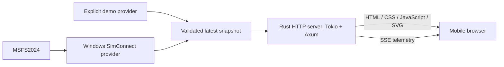

# Architecture

This document defines the target architecture, component responsibilities,
dependency boundaries, and runtime behavior.

## System



Choose exactly one provider at startup. One Rust process contains acquisition,
normalization, current state, and the HTTP server. Initialize one Cargo package as
a library (`cargo init --lib`): reusable application logic lives in `src/lib.rs`
and its modules. Thin executable entry points live in `src/bin/`, starting with
`src/bin/main.rs`. Additional applications can reuse the library without duplicating
server or telemetry logic; separate packages or services require a concrete need.

## Boundaries

| Component | Responsibility |
| --- | --- |
| CLI | clap argument parsing, help/version output, conversion into library configuration |
| Configuration | Source selection, validated listen address/port, sampling settings |
| Telemetry | Typed normalized attitude, validity, sequence, and freshness |
| Demo provider | Repeatable scenarios and explicitly marked synthetic data |
| SimConnect provider | SDK ownership, callbacks, units/signs, simulator lifecycle |
| State distribution | Latest snapshot with bounded memory, shared by all clients |
| HTTP | Static assets, health, SSE framing, subscriptions, graceful shutdown |
| Browser | Validate messages, display instrument/status, detect receive timeout |

Keep SDK types out of telemetry and HTTP. A dedicated worker owns any blocking
SimConnect callback loop and communicates normalized state to the async runtime.
Windows x64 MSVC is the only supported Rust build and runtime target. Use an
opt-in feature for SDK dependencies so demo builds and default tests run on
Windows without the SDK. CI runs on Windows only.

A Tokio latest-value watch channel is the initial distribution choice. Intermediate
samples may be skipped by slow consumers. Do not queue flight history. Recompute
sample age before serialization and expire samples server-side even if the source
stops publishing. Bound per-client buffering and close stalled writers so a slow
connection cannot retain resources indefinitely.

## Intended source layout

The target layout separates application configuration, telemetry, providers,
HTTP transport, and browser presentation.

```text
Cargo.toml                  # library package with binary targets, edition 2024
Cargo.lock                  # committed application dependency lock
src/
  lib.rs                    # reusable application API and assembly
  bin/
    main.rs                 # thin clap CLI, runtime startup, shutdown wiring
  config.rs
  telemetry.rs              # transport-independent normalized model
  providers/
    mod.rs                  # shared source boundary
    demo.rs
    simconnect.rs           # Windows-only SDK integration
  http/
    mod.rs                  # routes and application state
    sse.rs
web/
  index.html
  styles.css
  app.js                    # EventSource and UI lifecycle
  horizon.js                # pure attitude-to-display transformation
tests/
  http_sse.rs
  fixtures/                 # known attitudes and lifecycle states
.github/workflows/ci.yml
```

Use `clap` with its derive API for CLI arguments, including source selection,
listen address/port, and standard help/version output. Keep argument parsing in
the binary boundary; the library accepts typed configuration and never reads
process arguments itself. Validate configuration at the library boundary so other
binaries and tests receive the same guarantees. Start the executable with
`cargo run --bin main`; future binaries use their own names.

The library exposes typed `Config`/`Source` and `Server::bind`,
`Server::local_address`, and `Server::run(shutdown)`. Binding validates configuration
before acquiring the listener. Shutdown is supplied by the caller; only the CLI
owns process signal handling. Source selection is explicit; a provider failure
must never cause an automatic switch to demo. The `simconnect` feature gates
Windows-only SDK integration and dependencies.

The providers module owns `Source` and `SourceError`. Configuration consumes the
source type and wraps availability failures in `ConfigError::Source`, so providers
do not depend on application configuration. The library re-exports these types
for callers.

Embed web assets into the release binary. The browser uses a relative SSE URL from
the same origin. No CDN, frontend package manager, CORS policy, or database is needed.

## Session and lifecycle

Opening the page issues normal HTTP GET requests and one EventSource GET request.
Application telemetry flows only toward the browser; HTTP requests and transport
acknowledgements still exist. A session ends when the subscription closes.

Immediately send current state to each subscriber. EventSource handles transport
reconnection. A new connection gets current state rather than missed samples.
Keep source health separate from HTTP liveness: `/health` can be healthy while
the simulator is unavailable, which must be reported in telemetry.

When a page resumes from the background, mark it as waiting until a new valid
snapshot arrives. Do not extrapolate attitude through a pause or disconnection.

## Deployment

The intended default listen address is `127.0.0.1:8080`. Explicit LAN mode binds a
selected interface or `0.0.0.0:8080`; the startup message must show an actual LAN IP
for the phone URL. `localhost` on a phone points to the phone, not the simulator PC.

Use the same private network and a Windows Firewall rule scoped to that network.
No port forwarding or public hosting is in MVP scope. LAN mode allows devices
on that network to read telemetry; there is no authentication in this scope.
Remote access would need a separate access-control/TLS decision.

## Integration uncertainty

The official [SimConnect SDK](https://docs.flightsimulator.com/msfs2024/retail/programming-apis/simconnect/simconnect-sdk/)
supports add-on communication with MSFS2024. Rust binding choice, exact SDK
prerequisites, signs/units, and redistribution requirements remain the subject of
[#5](https://github.com/LeszekKantorek/msfs2024-artificial-horizon/issues/5).
Do not select a wrapper solely because it supported an earlier simulator version.

See [ADR 0001](adr/0001-rust-http-sse.md) and the [wire contract](telemetry-contract.md).

## Library telemetry interface

`telemetry::channel(Source)` returns one `Publisher` and a cloneable `Subscription`.
The publisher accepts typed `State`; only `State::Live(Attitude)` carries validated
normalized degrees. A provider must emit live only for fresh callbacks from an
active, unpaused source and emit explicit unavailable states otherwise. It calls
`Publisher::expire()` on an independent 50 ms freshness tick even if callbacks stop.
The demo runtime owns both sample and freshness ticks, with skipped missed ticks.

`Subscription::snapshot()` obtains current state without acknowledging a pending
publication; `changed().await` waits for and acknowledges the newest publication.
`snapshot_and_update()` reads and acknowledges current state atomically for the
first SSE event, preventing an already pending publication from being delivered twice.
Both compute age at read time and suppress expired live attitude, even before the
freshness tick runs. `Snapshot` is an immutable serializable v1 value: acquire it
immediately before sending, rather than cache the wire value. The internal accepted
sample timestamp is never serialized. The channel retains one current value and
has no history queue; source identity remains fixed for its lifetime.

`Server::telemetry()` exposes this subscription before `run` starts acquisition.
`Server::run` owns one demo task and joins it on shutdown or HTTP failure. Producer
failure triggers HTTP shutdown and is returned to the caller. No SSE route is
introduced by the telemetry model; HTTP delivery remains a separate boundary.

`http::router_with_telemetry(subscription)` adds SSE to the static router without
starting a provider; Server uses its single acquisition channel. Embedded browser
modules display separate transport/source status and own one subscription and
retry timer. The HTTP connection adapter enforces stalled-write and shutdown
deadlines as specified in [ADR 0002](adr/0002-sse-connection-lifecycle.md).

The browser telemetry client reports source/transport status and optionally delivers
fresh attitude with a local monotonic expiry deadline through `onAttitude`.
The instrument renderer retains only the latest sample and one pending animation
frame, checks expiry before drawing, and cancels pending work on unavailable status.
Pure SVG transforms live in `horizon.js`; `app.js` owns DOM updates and page lifecycle.
Pitch translation is nested inside bank rotation so mixed attitudes move in the
world's local coordinates. No interpolation or extrapolation is applied.
