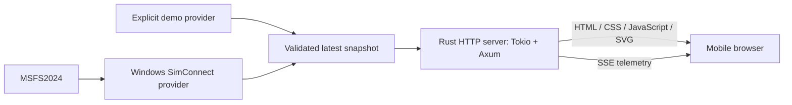

# Architecture

Status: implementation baseline; no runtime code exists yet.

## System



Choose exactly one provider at startup. One Rust process contains acquisition,
normalization, current state, and the HTTP server. A single binary crate is enough;
separate crates or services require a concrete need.

## Boundaries

| Component | Responsibility |
| --- | --- |
| Configuration | Source selection, validated listen address/port, sampling settings |
| Telemetry | Typed normalized attitude, validity, sequence, and freshness |
| Demo provider | Repeatable scenarios and explicitly marked synthetic data |
| SimConnect provider | SDK ownership, callbacks, units/signs, simulator lifecycle |
| State distribution | Latest snapshot with bounded memory, shared by all clients |
| HTTP | Static assets, health, SSE framing, subscriptions, graceful shutdown |
| Browser | Validate messages, display instrument/status, detect receive timeout |

Keep SDK types out of telemetry and HTTP. A dedicated worker owns any blocking
SimConnect callback loop and communicates normalized state to the async runtime.
Use an opt-in Windows-only feature for SDK dependencies. Demo and default tests
must compile on Windows and Linux without the SDK.

A Tokio latest-value watch channel is the initial distribution choice. Intermediate
samples may be skipped by slow consumers. Do not queue flight history. Recompute
sample age before serialization and expire samples server-side even if the source
stops publishing. Bound per-client buffering and close stalled writers so a slow
connection cannot retain resources indefinitely.

## Intended source layout

Create these files as their implementation issues are completed; this is a plan,
not a claim that these modules already exist.

```text
Cargo.toml                  # one application crate, edition 2024
Cargo.lock                  # committed application dependency lock
src/
  main.rs                   # startup and shutdown
  lib.rs                    # application assembly usable by integration tests
  config.rs
  telemetry.rs              # transport-independent normalized model
  providers/
    mod.rs                  # shared source boundary
    demo.rs
    simconnect.rs           # Windows-only SDK integration
  http/
    mod.rs                  # routes and application state
    sse.rs
web/
  index.html
  styles.css
  app.js                    # EventSource and UI lifecycle
  horizon.js                # pure attitude-to-display transformation
tests/
  http_sse.rs
  fixtures/                 # known attitudes and lifecycle states
.github/workflows/ci.yml
```

Embed web assets into the release binary. The browser uses a relative SSE URL from
the same origin. No CDN, frontend package manager, CORS policy, or database is needed.

## Session and lifecycle

Opening the page issues normal HTTP GET requests and one EventSource GET request.
Application telemetry flows only toward the browser; HTTP requests and transport
acknowledgements still exist. A session ends when the subscription closes.

Immediately send current state to each subscriber. EventSource handles transport
reconnection. A new connection gets current state rather than missed samples.
Keep source health separate from HTTP liveness: `/healthz` can be healthy while
the simulator is unavailable, which must be reported in telemetry.

When a page resumes from the background, mark it as waiting until a new valid
snapshot arrives. Do not extrapolate attitude through a pause or disconnection.

## Deployment

The intended default listen address is `127.0.0.1:8080`. Explicit LAN mode binds a
selected interface or `0.0.0.0:8080`; the startup message must show an actual LAN IP
for the phone URL. `localhost` on a phone points to the phone, not the simulator PC.

Use the same private network and a Windows Firewall rule scoped to that network.
No port forwarding or public hosting is in MVP scope. LAN mode allows devices
on that network to read telemetry; there is no authentication in this scope.
Remote access would need a separate access-control/TLS decision.

## Integration uncertainty

The official [SimConnect SDK](https://docs.flightsimulator.com/msfs2024/retail/programming-apis/simconnect/simconnect-sdk/)
supports add-on communication with MSFS2024. Rust binding choice, exact SDK
prerequisites, signs/units, and redistribution requirements remain the subject of
[#5](https://github.com/LeszekKantorek/msfs2024-artificial-horizon/issues/5).
Do not select a wrapper solely because it supported an earlier simulator version.

See [ADR 0001](adr/0001-rust-http-sse.md) and the [wire contract](telemetry-contract.md).
