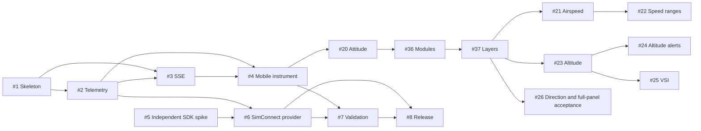

# Delivery roadmap

Track progress in [MVP issue #9](https://github.com/LeszekKantorek/msfs2024-artificial-horizon/issues/9).

> This roadmap defines order and dependencies. GitHub Issues own status and acceptance criteria.

## Stage 1: Demo from source to phone

| Order | Issue | Depends on | Deliverable |
| --- | --- | --- | --- |
| 1 | [#1 Rust skeleton and CI](https://github.com/LeszekKantorek/msfs2024-artificial-horizon/issues/1) | None | Library, thin clap CLI, static page, `/health`, checks |
| 2 | [#2 Telemetry and demo provider](https://github.com/LeszekKantorek/msfs2024-artificial-horizon/issues/2) | #1 | Typed current state and repeatable attitudes |
| 3 | [#3 SSE sessions](https://github.com/LeszekKantorek/msfs2024-artificial-horizon/issues/3) | #1, #2 | Current snapshots, reconnect, bounded consumers |
| 4 | [#4 Mobile instrument](https://github.com/LeszekKantorek/msfs2024-artificial-horizon/issues/4) | #2, #3 | Responsive attitude and honest status |

> **Exit:** A phone displays marked demo attitude and recovers after connection loss without reload. The full path requires no simulator SDK.

## Stage 2: G5 PFD demo vertical slice

* [Panel presentation](pfd-presentation.md): modules, frame lifecycle, and layers.
* [Project brief](project-brief.md): 18 included elements, exclusions, responsive layout without a fixed aspect ratio.
* [#19](https://github.com/LeszekKantorek/msfs2024-artificial-horizon/issues/19): scope and backlog work.

| Order | Issue | Depends on | Deliverable |
| --- | --- | --- | --- |
| 1 | [#20 Responsive PFD attitude and coordinated turn](https://github.com/LeszekKantorek/msfs2024-artificial-horizon/issues/20) | #4 | Mobile layout, refined attitude, slip/skid and turn rate |
| 2 | [#36 Modular rendering](https://github.com/LeszekKantorek/msfs2024-artificial-horizon/issues/36) | #20 | Instrument modules and panel scheduling, preserving the image |
| 3 | [#37 Layered composition](https://github.com/LeszekKantorek/msfs2024-artificial-horizon/issues/37) | #36 | Shared attitude background and translucent instrument overlays |
| 4 | [#21 Airspeed and ground speed](https://github.com/LeszekKantorek/msfs2024-artificial-horizon/issues/21) | #37 | IAS tape/readout and GS |
| 5 | [#22 Speed ranges, V-speeds and trend](https://github.com/LeszekKantorek/msfs2024-artificial-horizon/issues/22) | #21 | Demo profile, references, trend and VNE indications |
| 6 | [#23 Altitude and barometric setting](https://github.com/LeszekKantorek/msfs2024-artificial-horizon/issues/23) | #37 | Altitude tape/readout and baro |
| 7 | [#24 Selected altitude and alerts](https://github.com/LeszekKantorek/msfs2024-artificial-horizon/issues/24) | #23 | Target bug/readout and approach/deviation alerts |
| 8 | [#25 Vertical speed](https://github.com/LeszekKantorek/msfs2024-artificial-horizon/issues/25) | #23 | VSI scale and indication |
| 9 | [#26 Heading, track and selected direction](https://github.com/LeszekKantorek/msfs2024-artificial-horizon/issues/26) | #37 | PFD direction tape and accumulated full-panel demo acceptance |

* Deliver in steps 1-9 order.
* [#35](https://github.com/LeszekKantorek/msfs2024-artificial-horizon/issues/35) owns planning and is not a delivery step.
* Merge the planning documentation before #36 starts.
* #26 owns accumulated acceptance after all preceding instrument steps have evidence.
* Read dependencies as technical prerequisites, not dependencies on every preceding row.
* Feature issues deliver typed data, deterministic Rust demo, SSE, presentation, tests, and documentation.
* #36 and #37 change presentation only and preserve the wire contract.
* Each implementation issue uses a separate branch and PR.
* Use one reviewable feature PR per issue.
* Keep selected values read-only and demo-supplied.
* Add no battery, HSI, or navigation-guidance slice.

| Exit criterion | Evidence owner |
| --- | --- |
| All 18 elements meet their criteria on real iOS Safari and Android Chrome | Each slice, accumulated in #26 |
| Readable portrait/landscape from 320 CSS px | Each slice |
| Explicit unavailable indications and recovery without reload | Each slice |
| Full-panel acceptance | #26 |

> This evidence establishes demo behavior only. Stages 3-4 retain existing scope and dependencies.
> The attitude-only provider leaves new PFD values unavailable. Live PFD integration requires separate future scope.

## Stage 3: Real simulator data

| Order | Issue | Depends on | Deliverable |
| --- | --- | --- | --- |
| Early investigation | [#5 SimConnect compatibility spike](https://github.com/LeszekKantorek/msfs2024-artificial-horizon/issues/5) | None | Proven binding/setup, signs, units, lifecycle |
| Integration | [#6 Windows SimConnect provider](https://github.com/LeszekKantorek/msfs2024-artificial-horizon/issues/6) | #2, #5 | Live data, reconnect, pause/flight lifecycle |

* Start #5 early, independently of both demo stages.
* Limit the initial investigation to one day.
* Produce evidence or a concrete blocker.
* Defer SDK/binding decisions until evidence exists.

> **Exit:** The same instrument displays real MSFS2024 attitude with explicit unavailable/paused states. Demo remains separately selectable.

## Stage 4: Validate and distribute

| Order | Issue | Depends on | Deliverable |
| --- | --- | --- | --- |
| Validation | [#7 Mobile reliability and latency](https://github.com/LeszekKantorek/msfs2024-artificial-horizon/issues/7) | #4, #6 | Device evidence and measured targets |
| Packaging | [#8 Windows MVP release](https://github.com/LeszekKantorek/msfs2024-artificial-horizon/issues/8) | #6, #7 | Executable, prerequisites, tested setup guide |

> **Exit:** A user starts the Windows package and connects a phone through documented steps, without development tools.
> Release notes distinguish measured behavior from remaining limitations.

## Change control

1. Create an issue for additional instruments or deployment modes.
2. Change scope and acceptance criteria before adding them to the MVP.
3. Close issues only when evidence meets their criteria.

Repository preparation does not close implementation tasks.
